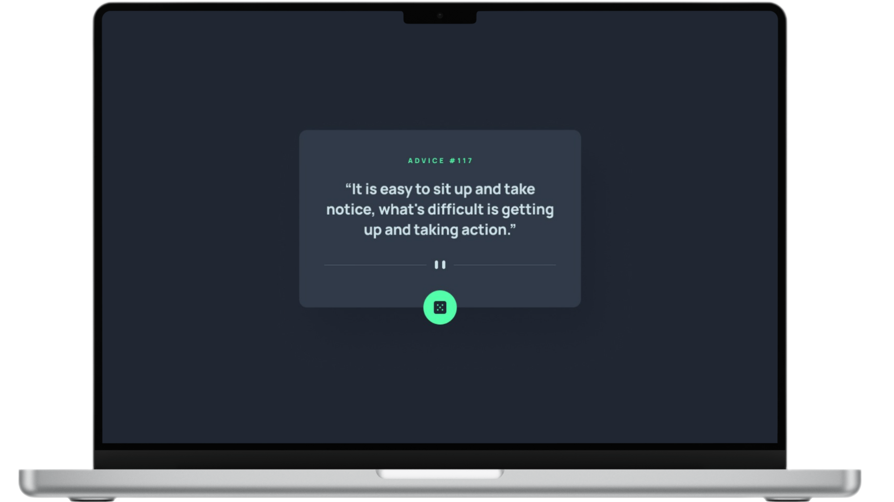

#  Advice - Gerador de Conselho

<figure>
    
</figure>

## 📝 **Sobre o Projeto**

    ADVICE é uma web aplicação que utiliza a API Advice Slip para gerar conselhos aleatórios. Este web app, com um design mobile-first, é responsivo para todos os dispositivos. Ele consome um REST API para buscar conselhos. O design é simples e intuitivo, facilitando o uso. Ao clicar no botão de dado, o app consome a API Advice Slip e gera um conselho com apenas um clique.

[Demo do Projeto](https://advice-walacedev.netlify.app/) 

## 🛠️ **Tecnologias Utilizadas**

- **HTML5** para a estrutura do conteúdo.
- **CSS3** para estilização e design responsivo.
- **JavaScript** para funcionalidades dinâmicas.

## 🚀 **Recursos Principais**

- **Botão de dado:** Ao clicar no botão, o app faz uma requisição à REST API Advice Slip e exibe um novo conselho com um único clique.
- **Design mobile-first:** O layout é otimizado primeiramente para dispositivos móveis, garantindo uma experiência de usuário agradável em smartphones e tablets.
- **Responsividade:** O web app é totalmente responsivo, adaptando-se a diferentes tamanhos de tela, incluindo desktops e laptops.
- **Interface simples e intuitiva:** O design é limpo e fácil de usar, tornando a navegação intuitiva para os usuários.

## 📂 **Estrutura do Projeto**

├── src 
│   ├── assets          # Imagens 
│   ├── css             # Arquivo de estilização 
│   └── js              # Arquivo de JavaScript 
├── .gitattributes      # Configurações de atributos do Git 
├── LICENSE             # Licença MIT 
├── README.md           # Documentação do projeto 
└── index.html          # Arquivo principal HTML do projeto
